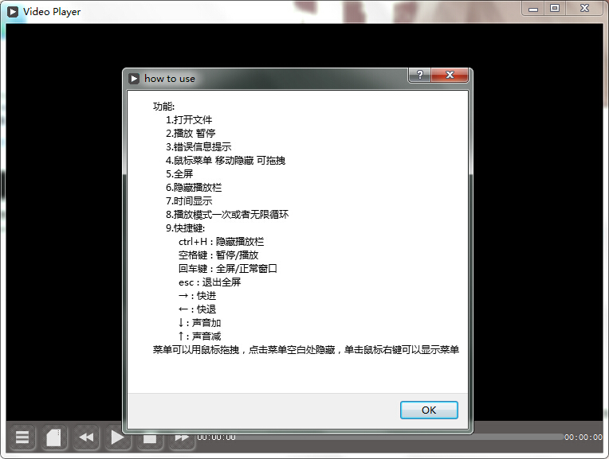
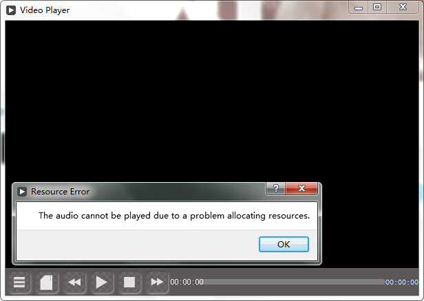
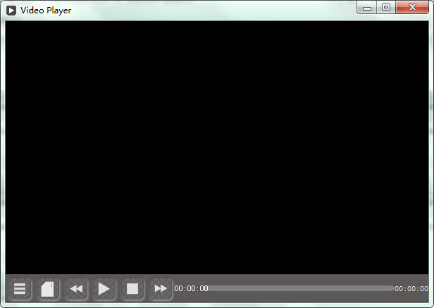
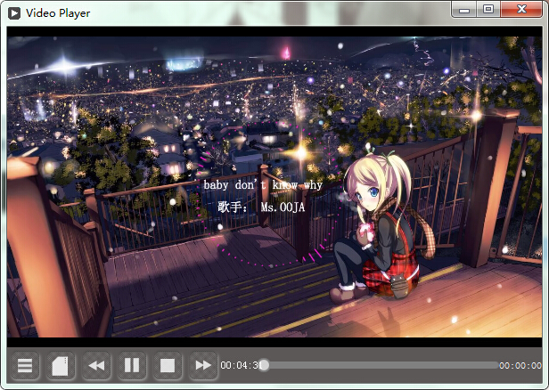

# 简单播放器界面

功能：

1. 打开文件

2. 播放 暂停 

3. 错误信息提示

4. 鼠标菜单 移动隐藏 可拖拽

5. 全屏

6. 隐藏播放栏

7. 时间显示

8. 播放模式一次或者无限循环

9. 快捷键:

    ctrl+H : 隐藏播放栏

    空格键 : 暂停/播放

    回车键 : 全屏/正常窗口

    → : 快进

    ← : 快退

    ↓ : 声音加

    ↑ : 声音减

---

- 没有播放列表

- 不能播放网络媒体流（可以的，需要网络支持）

- 不能显示媒体信息

- 不能播放rmvb

